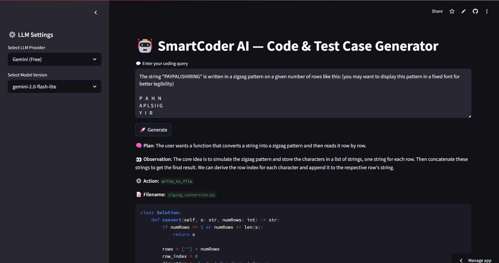

# 🤖 SmartCoder AI — Code & Test Case Generator

SmartCoder AI is a powerful coding assistant that uses LLMs like Gemini, ChatGPT, Claude, and Groq to automatically:

- Generate optimized code based on your query
- Write unit test cases for the generated code
- Suggest commands to run your solution locally
- Support both predefined and custom LLM models

Built with ❤️ using [Streamlit](https://streamlit.io/) and [OpenAI-compatible SDKs](https://pypi.org/project/openai/).

🔗 **Live App**: [https://smartcoder-ai.streamlit.app](https://smartcoder-ai.streamlit.app)

---

## 🔧 Features

- ✅ Select from multiple LLM providers: Gemini, Claude, ChatGPT, Groq
- ✅ Choose model versions or enter your own custom model
- ✅ Provide your own API key for paid models or use `.env` for free ones
- ✅ Real-time display of reasoning, actions, code, and output
- ✅ Fully open-source and easy to customize

---

## 📸 Screenshot



---

## 🚀 Getting Started

### 1. Clone the repository

```bash
git clone https://github.com/Abhiram-23/SmartCoderAI.git
cd SmartCoderAI
pip install -r requirements.txt
GEMINI_API_KEY=your_gemini_key
CLAUDE_API_KEY=your_claude_key
streamlit run app.py
```

```bash
git add image.png
git commit -m "Add UI screenshot"
git push
```
